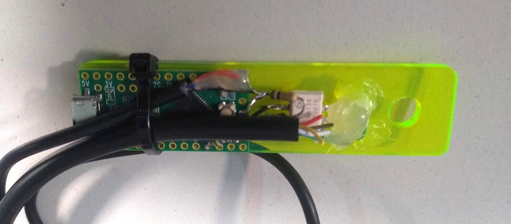

# Sync Kaoss Pad 3 midi clock out to Korg Volca clock in

Kaoss pad puts out midi beat clock https://en.wikipedia.org/wiki/MIDI_beat_clock

# Circuit

https://www.instructables.com/Send-and-Receive-MIDI-with-Arduino/

# Firmware

24 pulses per beat. Volca modular wants 12 per beat. 

Use callback on midi clock and a simple state machine to make 5ms pulses positive pulses for Volca.

[source](src/clock.ino)

# Midi library

https://github.com/FortySevenEffects/arduino_midi_library

details on choosing different hardware serial: https://www.pjrc.com/teensy/td_libs_MIDI.html

# WS2812 LED Bar marker

Use a strip of WS2812 LEDs plus the FastLED library to show current bar.
